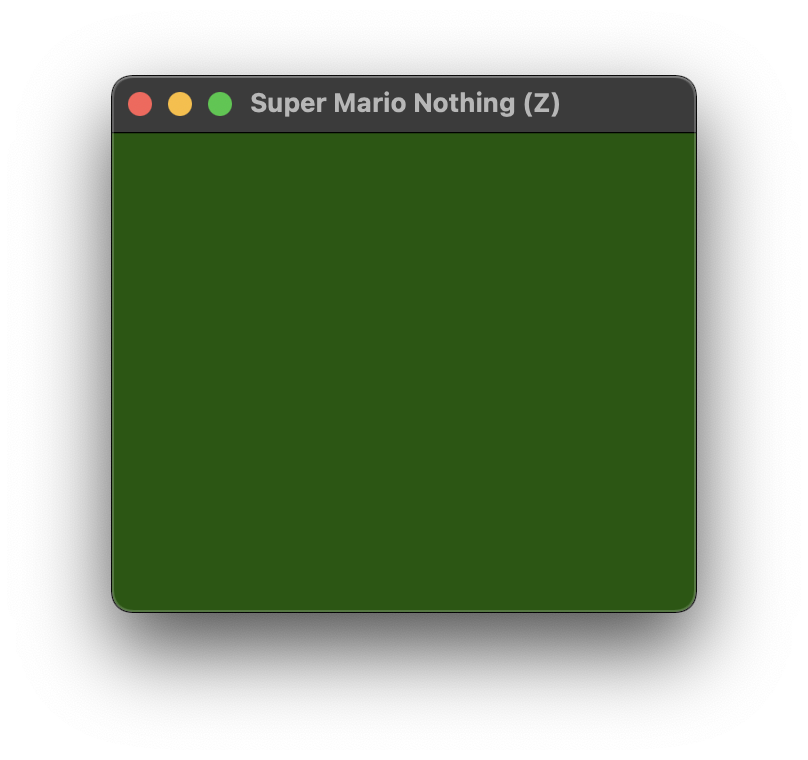

# *Super Mario Nothing*

# [Download the *Super Mario Nothing* ROMS](https://github.com/pippinbarr/super-mario-nothing/releases/tag/roms) for your NES emulator of choice

## Description

*Get ready to not jump on Goombas! Under a cloudless sky! Because there is no sky! Because there isn't anything! Enjoy your time off!*

*Super Mario Nothing* is kind of a ROM hack of *Super Mario Bros.* for the NES. Except the hack is to delete everything while making sure the game still runs. There are two versions available. The (D) version (for *D*eleted) is a *Super Mario Bros.* ROM where all the data has been removed. The (Z) version (for *Z*eroed) is a *Super Mario Bros.* ROM where all the data has been zeroed out. Why? Because I needed an easy project, give me a break. Also I think it's a way to think about destruction as creation, the copyright status of erased data, the relationships between process and outcome, and *stuff like that*.

*Super Mario Nothing* was created using VS Code to edit the hex code in a ROM of *Super Mario Bros.*. I referred to the [NesDev.org wiki](https://www.nesdev.org/wiki/INES) for an explanation of the header information in NES ROMs.

Would I like to make an actual cartridge version of this game? Yes I would.

## Documentation

* Read the [Process documentation](../process/)
* Read the [Commit History](https://github.com/pippinbarr/super-mario-nothing/commits/main) (not super-duper relevant to this project)
* Look at the [Code Repository](https://github.com/pippinbarr/super-mario-nothing)

## Press

Read the [Press Kit](../press) for press information

## License

*Super Mario Nothing* is an open source game licensed under a [Creative Commons Attribution-NonCommercial 3.0 Unported License](http://creativecommons.org/licenses/by-nc/3.0/). You can obtain the source code from its [code repository](https://github.com/pippinbarr/super-mario-nothing) on GitHub.
