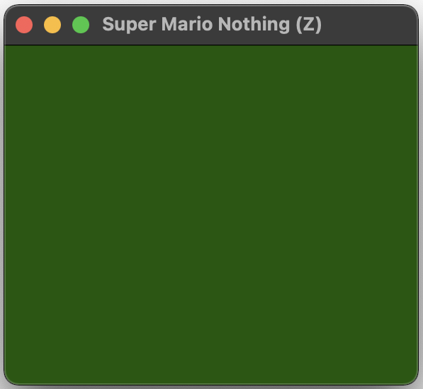

# *Super Mario Nothing*

# Download the [*Super Mario Nothing* ROM](https://github.com/pippinbarr/super-mario-nothing/releases/tag/rom) for NES

## Description

*...*

*Super Mario Nothing* is ...

*Super Mario Nothing* was created ...

## Documentation

* Read the [Process documentation](../process/) for process journal, to do list, and related work
* Read the [Commit History](https://github.com/pippinbarr/super-mario-nothing/commits/main) for step-by-step information about how the project was built
* Look at the [Code Repository](https://github.com/pippinbarr/super-mario-nothing) for source code etc.

## Press

Read the [Press Kit](../press) for press information

## License

*Super Mario Nothing* is an open source game licensed under a [Creative Commons Attribution-NonCommercial 3.0 Unported License](http://creativecommons.org/licenses/by-nc/3.0/). You can obtain the source code from its [code repository](https://github.com/pippinbarr/super-mario-nothing) on GitHub.
