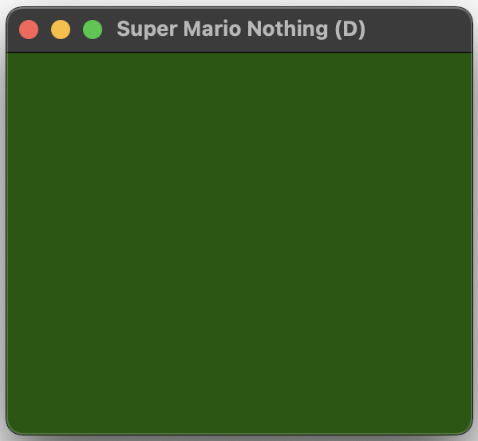
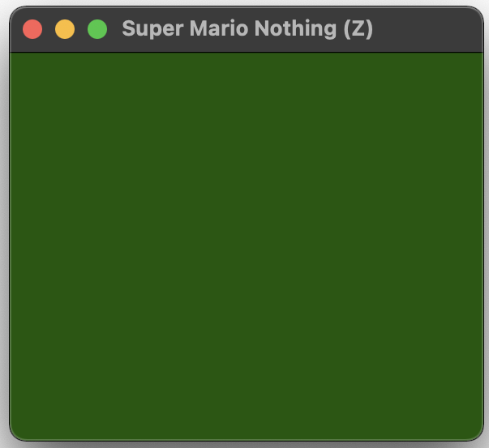

# *Super Mario Nothing* Press Kit

#### [Download the *Super Mario Nothing* ROMS](https://github.com/pippinbarr/super-mario-nothing/releases/tag/roms) for your NES emulator of choice

## The basics

* Developer: [Pippin Barr](http://www.pippinbarr.com/)
* Release: 11 August 2023
* Platform: NES (emulation)
* Code repository: <https://www.github.com/pippinbarr/super-mario-nothing/>
* Price: $0.00

## Description

*Get ready to not jump on Goombas! Under a cloudless sky! Because there is no sky! Because there isn't anything! Enjoy your time off!*

*Super Mario Nothing* is kind of a ROM hack of *Super Mario Bros.* for the NES. Except the hack is to delete everything while making sure the game still runs. There are two versions available. The (D) version (for *D*eleted) is a *Super Mario Bros.* ROM where all the data has been removed. The (Z) version (for *Z*eroed) is a *Super Mario Bros.* ROM where all the data has been zeroed out. Why? Because I needed an easy project, give me a break. Also I think it's a way to think about destruction as creation, the copyright status of erased data, the relationships between process and outcome, and *stuff like that*.

## History

I started making *Super Mario Nothing* because I was feeling depressed about the state of my own practice of making games regularly. Although I'd been making a couple of secret things for Google, I felt that I wasn't really getting at that need to just make small stuff and put it in the world. For some reason this led me to think about the minimal game I could make, which was nothing. I've pursued a version of this idea in [The Nothings Suite](https://pippinbarr.com/the-nothings-suite/) but I wanted to be even more ridiculous and simplistic. That's when I thought about just deleting an existing game instead of making my own.

At that point, it seemed obvious to choose something iconic, and hence *Super Mario Bros.*, a common target of ROM hacks, and famously the target of Cory Archangel's *Super Mario Clouds*, another act of deletion-as-creation (maybe). Thus, the project became to figure out how to delete *Super Mario Bros.* while leaving it still running, and the project ran on from there. The full story is in the [process documentation](../process).

## Technical

*Super Mario Nothing* was created using VS Code to edit the hex code in a ROM of *Super Mario Bros.*. I referred to the [NesDev.org wiki](https://www.nesdev.org/wiki/INES) for an explanation of the header information in NES ROMs.

Would I like to make an actual cartridge version of this game? Yes I would.

## Features

* Nothing!
* Nothing!
* Nothing!
* Nothing!
* Wait was that Mario?! No!

## Images

## Credits

* Pippin Barr: everything.
* Nintendo: everything I removed.

## Contact

* Email: [pippin.barr+press@gmail.com](mailto:pippin.barr+press@gmail.com)
* Website: [www.pippinbarr.com](http://www.pippinbarr.com/)
* Twitter: [@pippinbarr](https://www.twitter.com/pippinbarr)
* Facebook: [Pippin Barr](http://www.facebook.com/pippin.barr)
