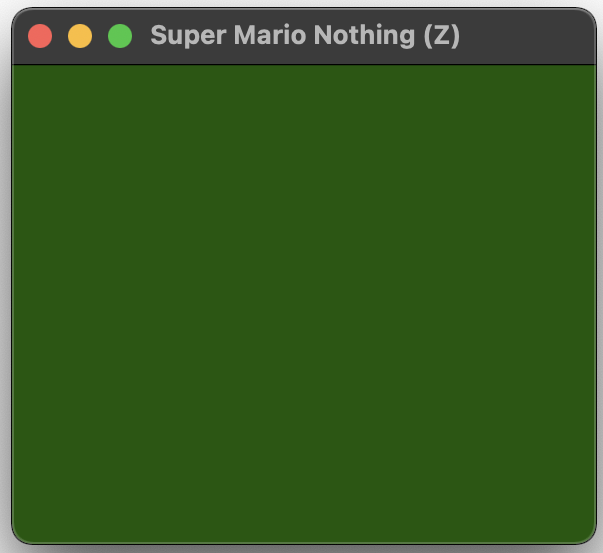

# It's a Question of Nothing

(Note: this is my first attempt in a while to write a closing statement, but I feel like it's an important - if difficult-to-really-get-into - part of MDM, so let's just see how it goes.)

*Super Mario Nothing* is mostly nothing, just two ROM files, each of which run successfully in an NES emulator and display only a green screen. One was created by simply deleting all the data in the ROM except for its header, and updating the header accordingly (it states how much data is in the ROM) – this is the (D) for "deleted" version. The other was created by manually zeroing out all the data in the original rom (which took kind of a long time) – this is the (Z) for "zeroed" version. At heart, I made this game because it felt like the simplest possible project I could pick up and finish quickly: just delete someone else's game. In the end it has taken over a month to actually get it finished, mostly because of *life* but also because it turned out to be more complicated and time consuming to reflect on than I'd anticipated at the outset. As always, the joke turns into philosophy.

It doesn't feel to me like it has the form of a tidy answer to a question, and it doesn't really demonstrate any particular design principle or conversation with game design, which I suppose it my normal mode. Instead, it's a much more process oriented piece of work (and therefore possibly interesting only to me, the processer). For that reason, though, it's quite a useful application of MDM - to the extent that the method is about surfacing process and rationales that can't necessarily be seen in a final product. This is a pretty hardcore distillation of that idea: the final product is more or less nothing, so the documentation is kind of the only something we have here.

## The original

From the beginning a key question revolved around the status of "nothing" relative to an existing game. Philosophically, it was clear there needed to be the existing game at the beginning which was *transformed* into nothing (either having its data deleted or zeroed). Despite the fact you could clearly make a kind of "universal nothing" NES ROM by handcoding a header for an empty game (which would be identical in terms of data to my deletion version of the game), that didn't fit in with my understanding of the project.

A lot of this is coming from both Cory Archangel's [Super Mario Clouds](https://whitney.org/collection/works/20588) and Robert Rauschenberg's [Erased de Kooning Drawing](https://www.sfmoma.org/artwork/98.298/). They're both works of erasure that are attempting (succeeding I suppose) to making art by deleting/erasing/removing parts of another work of art.

Rauschenberg's one goes "all the way" in that it sort of ends up as a blank piece of paper, but of course there are still vestiges of the original drawing left behind. And also in Rauchenberg's work there's an original in the sense of a unique object in the world - there's only *one* of de Kooning's drawing and so its erasure is more impactful, actually removes information from the *world*. Whereas with *Super Mario Nothing*, well, there are other identical copies of the ROM, so the information still exists, it's just been removed from this one file.

And taking that further, as above, the *Super Mario Nothing* ROMs I produced would be *identical* to ROMs produced in another way but yielding the same (lack of) data. So they're "only" unique in terms of the process applied to them. And further this process has to be taken on faith to some extent, though I've tried to let the documentation process here speak to the fact that the project is in earnest and really took place. Could be an elaborate hoax though.

## Time versus lack of commitsment

One of the oddities of this project is that the data being deleted – that of *Super Mario Bros.* – is copyrighted. Because of that, I didn't feel able to include the original ROM or any subset of its actual data in the repository. That means there's no documentation at the level of commits that shows the gradual erasure of the rom (in the (Z) version).

That said, I did try to use MDM in ways that would communicate the ideas behind the process especially of the (Z) version which was the more process-intensive:

- The journal itself presents a day by day account of first understanding the header format, and then of gradually zeroing out the file while reflecting.
- I did record some video of the zeroing process to show the "on the ground" nature of zeroing out a file like this
- I included the in-progress file for the (Z) version in the `.gitignore` file to signal that the file *existed* even if it wasn't being included in the repository until it was totally empty.

## Copyrighted data

There are other things to say about the copyrighted nature of the data. In particular that question of how much of the data might find its way into the project regardless. I was careful not to commit the files themselves, but technically you could manually (or yeah sure with an AI) reconstitute an amount of the original ROM by pulling it out of the video of its deletion in a kind of manual "undo function". You wouldn't end up with a functional ROM but you'd have some of the original and copyrighted data.

So how much of the data constitutes a copyright violation then? How much of *Super Mario Bros.* do you have to delete before it's not *Super Mario Bros.* any more? If you just delete even one key piece of data, for instance, the game won't *run* but might have almost exactly the same information inside it (if you, for instance, corrupted the header data just a little bit).

Or even weirder, I did find myself thinking while I zeroed the file that there are a bunch of zeroes already in there, so when I zero those parts they actually remain the same, the original data. So, more or less totally invisibly, the zeroed file contains some percentage of the original data anyway. But yeah, obviously this illustrates important ideas about data on computers - it's relational and makes absolutely no sense without some critical mass of other (probably adjacent?) data. `00` isn't as meaningless as a "space" in a text in a human language, but on its own it doesn't tell you much. As a color it's probably black, as a part of an instruction it *might* tell you something? But I don't know enough about the encoding of the assembly language for NES ROMs to know.

## That's a wrap

So, in the end I feel like this project encouraged an engagement with and reflection on quite relevant ideas that lie beneath many games (copyright, data, file formats) as well as the question of process *as* art (erasure, how to represent erasure in a digital setting). And it worked as a test of MDM in a highly conceptual processual project. And crucially it means I "made a game" which was the reason I did it in the first place.
